Nama: Carleano Ravelza Wongso

NPM: 2306213022

Kelas: Adpro-B

# Java Profiling

## JMeter Result

### Before

#### /all-student-name
- View Results Tree
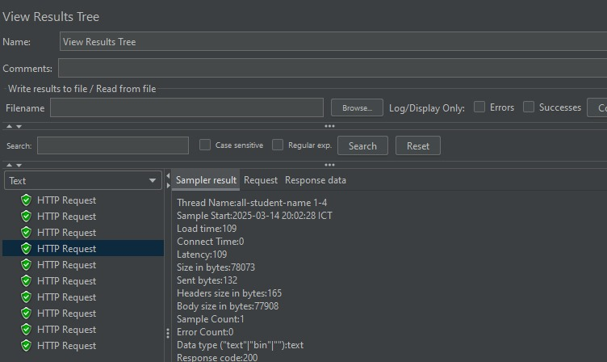
- View Results Table
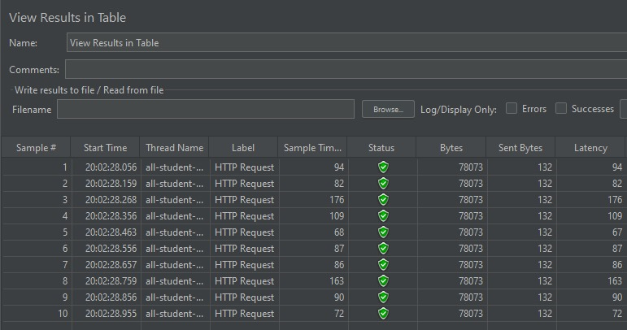
- Aggregate Report
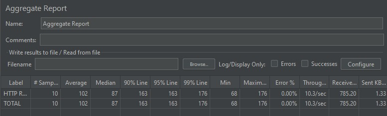
- Graph Results
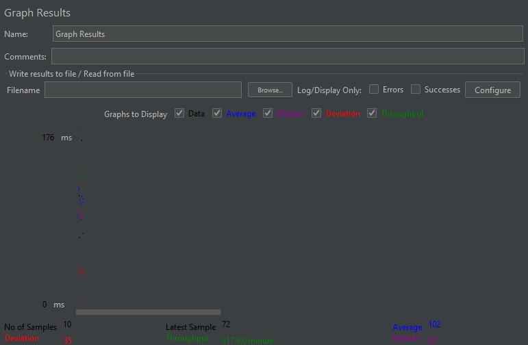

#### /highest-gpa
- View Results Tree
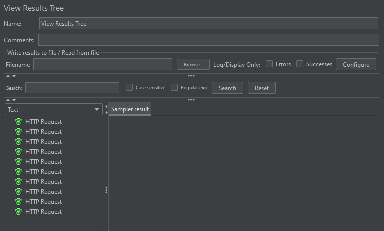
- View Results Table
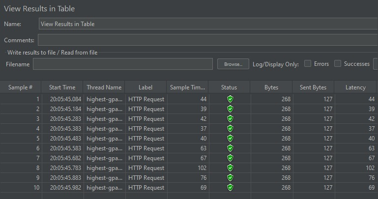
- Aggregate Report
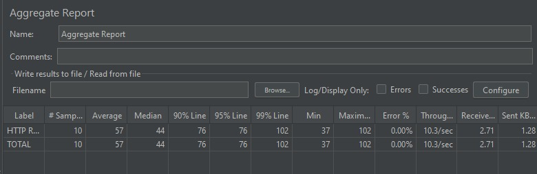
- Graph Results
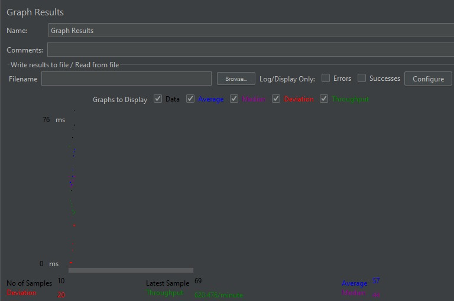

#### /all-student
- View Results Tree
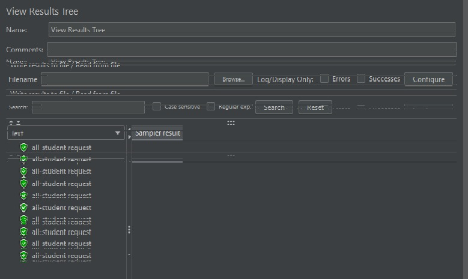
- View Results Table
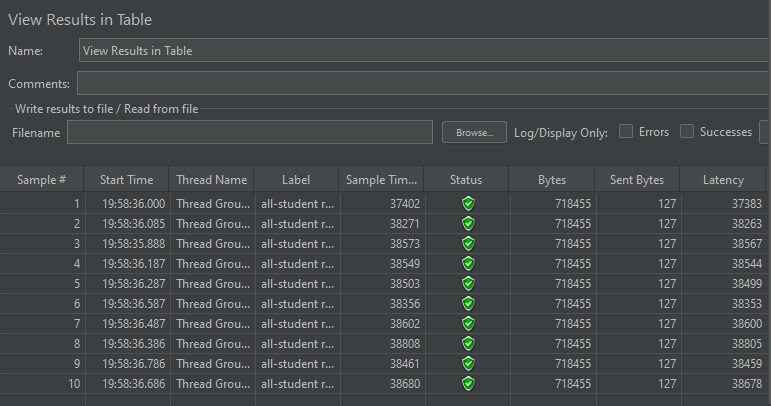
- Aggregate Report
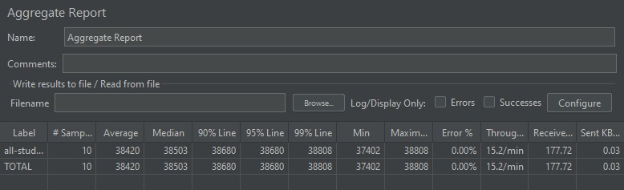
- Graph Results
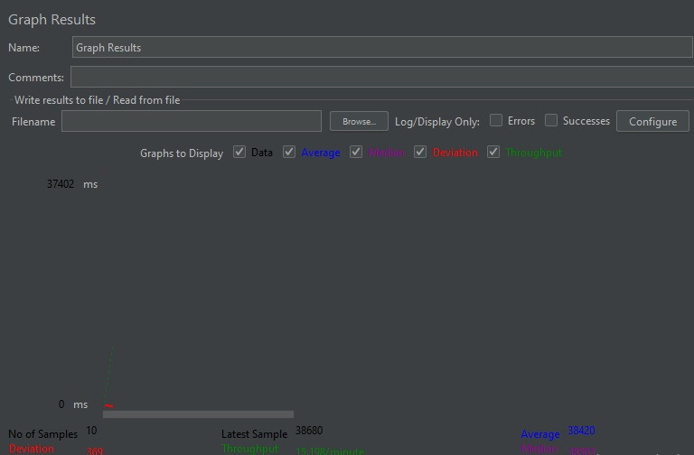

### After

#### /all-student-name
- View Results Tree
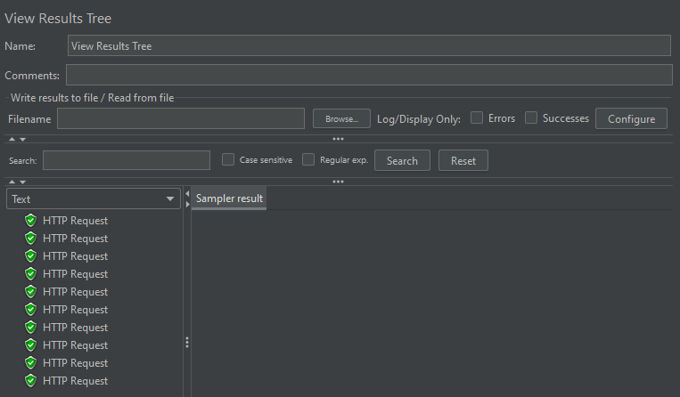
- View Results Table
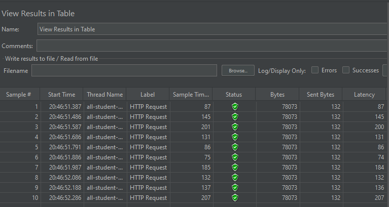
- Aggregate Report
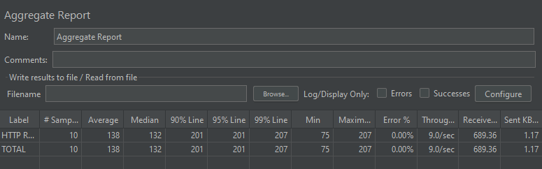
- Graph Results
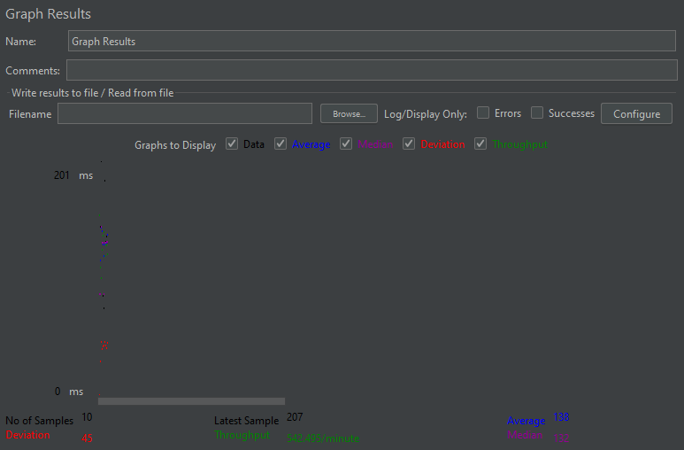

#### /highest-gpa
- View Results Tree
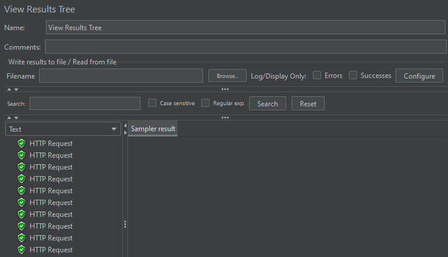
- View Results Table
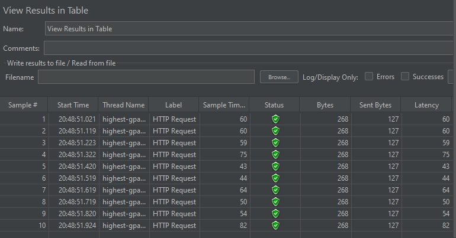
- Aggregate Report
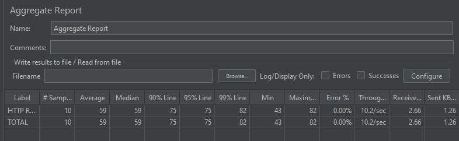
- Graph Results
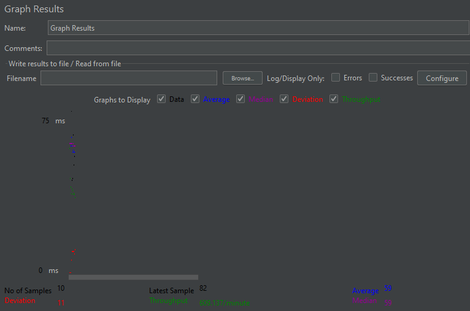

#### /all-student
- View Results Tree
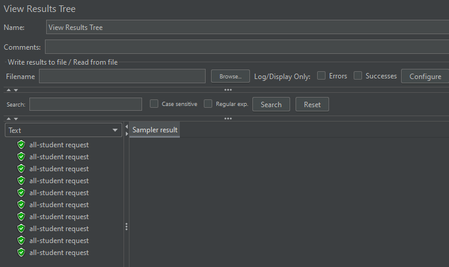
- View Results Table
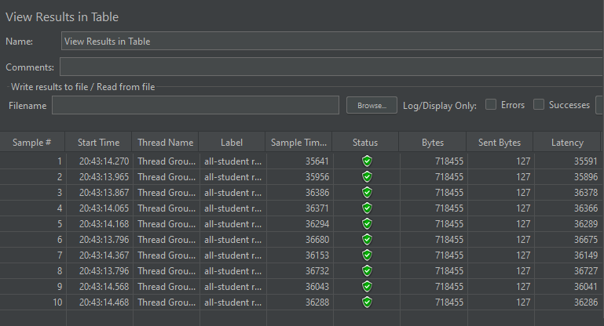
- Aggregate Report
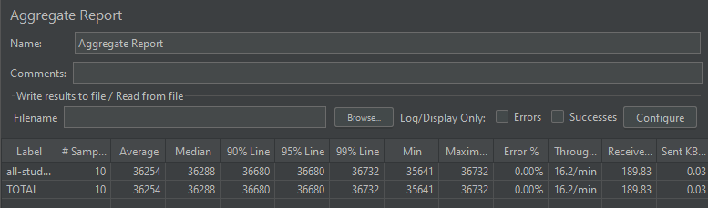
- Graph Results
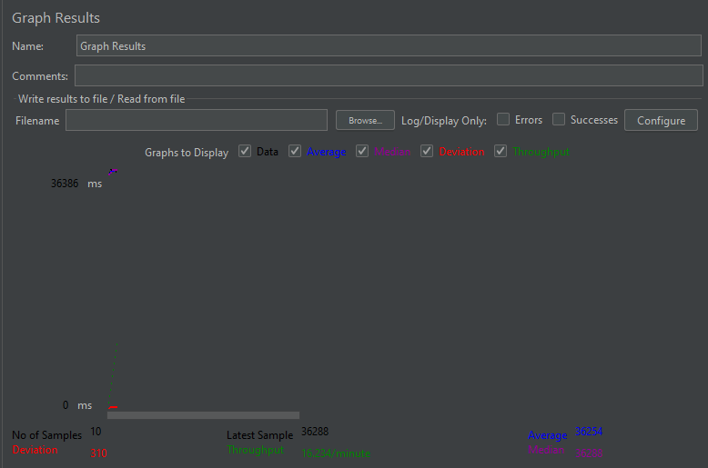

#### Conclusion 
After optimization, the profiling elapsed time is noticeably reduced. This enhancement highlights the impact of the applied optimizations, leading to improved performance and greater efficiency of the application.

# Reflection

### What is the difference between the approach of performance testing with JMeter and profiling with IntelliJ Profiler in the context of optimizing application performance?
Performance testing with JMeter focuses on simulating user load and measuring the application's response times, throughput, and error rates under various conditions. It helps identify performance issues from an end-user perspective. Profiling with IntelliJ Profiler, on the other hand, involves analyzing the application's internal behavior, such as CPU usage, memory allocation, and method execution times, to pinpoint specific code-level bottlenecks.

### How does the profiling process help you in identifying and understanding the weak points in your application?
Profiling provides detailed insights into the application's runtime behavior, allowing you to identify inefficient code paths, memory leaks, and resource-intensive operations. By examining the profiling data, you can understand which parts of the code are consuming the most resources and causing performance degradation.

### Do you think IntelliJ Profiler is effective in assisting you to analyze and identify bottlenecks in your application code?
Yes, IntelliJ Profiler is effective in analyzing and identifying bottlenecks. It offers a comprehensive set of tools to visualize and measure various performance metrics, making it easier to locate and address performance issues at the code level.

### What are the main challenges you face when conducting performance testing and profiling, and how do you overcome these challenges?
The main challenges include the time required to seed and access the database for each endpoint due to the large amount of data. Additionally, variations in computer environments and elapsed times can pose significant challenges. To overcome these, I optimize the application code to reduce the time needed to seed and access the database. I also ensure to run the test, both JMeter and IntelliJ Profiler, several times to account for variations and validate the results.

### What are the main benefits you gain from using IntelliJ Profiler for profiling your application code?
The main benefits include the ability to identify and fix performance bottlenecks, optimize resource usage, and improve overall application efficiency. IntelliJ Profiler's integration with the development environment also streamlines the profiling process, making it more accessible and easier to use.

### How do you handle situations where the results from profiling with IntelliJ Profiler are not entirely consistent with findings from performance testing using JMeter?
Of course, the results can vary due to differences in the testing and profiling methodologies. Performance testing with JMeter simulates user load and measures response times, throughput, and error rates, providing a high-level view of the application's performance under various conditions. Profiling with IntelliJ Profiler, however, offers a more granular analysis of the application's internal behavior, such as CPU usage, memory allocation, and method execution times.

Despite these differences, the results from both methods should generally align if the application is performing consistently. Discrepancies might arise due to factors like environmental differences, test configurations, or the specific aspects of performance being measured. To reconcile these differences, it's important to cross-reference findings from both tools, validate them against real-world scenarios, and ensure that any optimizations made improve performance across the board without introducing new issues.

### What strategies do you implement in optimizing application code after analyzing results from performance testing and profiling? How do you ensure the changes you make do not affect the application's functionality?
To optimize application performance, I use tools like JMeter and IntelliJ Profiler for analysis. JMeter simulates user load and measures response times, while IntelliJ Profiler provides insights into CPU usage and memory allocation. By using these tools, I identify performance bottlenecks and inefficiencies. My optimization efforts focus on removing unused and redundant functions, ensuring the application runs efficiently without compromising functionality. This approach helps in understanding and resolving performance issues effectively.
